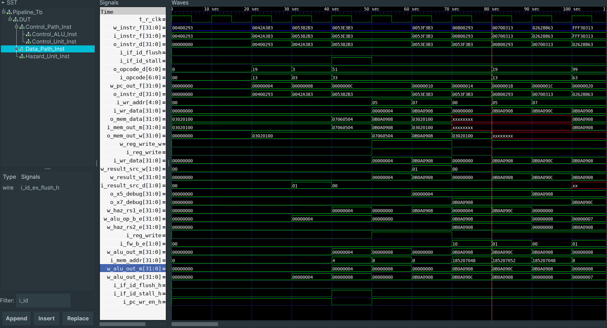

# Verilog Practice Projects

## 1. UART_tx_rx
Asynchronous data transmission between a transmitter and a receiver module. 
Bits are sent and received using a Baud Rate Generator. 
What I learned:  
-> UART protocol basics: data framing, start/stop bits, asynchronous data transfer. 
-> Transmit/Receive data pipelines(tdr/tsr and rsr/rdr). 
-> Unit testing is very important, testing after all code is written is a bad idea. 
-> Modular design is useful for easier an easier testing phase. 

## 2. FIFO parameterized memory
Data is stored/read starting from lower addresses. 
What I learned:  
-> The importance of handshake and validity signaling(read valid, write valid). 
-> The importance of status flags and thresholds(empty/full, almost empty/full). 
-> Better synthesizable logic(no latches, for loops, ). 
-> Better RTL simulation techniques, such as: assertions, more test cases, repeat blocks. 

## 3. Basic VGA output
In the simple_480p module the pixel position data is generated using internal counters. Here the hsync and vsync signals are also generated, when the pixel position is in the sync region. When the pixel position is inside the active range, the data enable signal is asserted. 
Two IP blocks are used:  
1. PLL block which generates a 270MHZ serial clock signal (from a 27MHZ base), and also a divided 27MHZ pixel clock signal. These are used in TMDS encoding (for the 8b/10b algorithm). 
2. DVI TX block, with ELVDS outputs for the color channels and the clock signal. 

What i learned:  
-> The fundamentals of the HDMI protocol, TMDS encoding and the benefits of data serialization/deserialization. 
-> The difference between true LVDS and emulated LVDS. The FPGA board I used doesn't have true LVDS pins and instead the DVI TX block emulates this logic using general purpose pins instead. 
-> How basic video output is generated, how color data is generated and sent to the display, what sync signals are. 

## 4. RISC-V Single Cycle
Single Cycle CPU: Executes each instruction in one clock cycle. 
 
Goal: Understanding the split between the Data Path and the control path. 
 
Key Characteristics: 
-> ISA: RV32I 
-> Separate data memory and instruction memory (Harvard Architecture) 

 
Execution Flow: 
-> Fetch: Read instruction from memory at the address from PC 
-> Decode: Identify opcode, source and destination registers, and the imm field 
-> Execute: Perform ALU operation or compute branch addr 
-> Memory Access: Load/Store data 
-> Write Back: Store result to register file 
-> Update PC 
 
Advantages: 
-> Easy to design and understand 
Disadvantages: 
-> Cycle time = Slowest instruction (lw) 
-> Not scalable for more complex cpu designs 
 
Supported instructions: 
-> R type (add, sub, or, etc) 
-> I type (lw, addi, jalr, etc) 
-> S type (sw) 
-> B type (jal) 
 
The design is tested using testbenches and simulations, and synthesized/implemented on a Sipeed Tang Nano 9k FPGA board. 
For testing purposes, the code programmed into the instruction memory waits for 5 seconds and then turns a led off. 
Initially, the cpu stays in a reset state, until an enable button is pressed. The button signal on the board is active low. 
The button signal goes through 3 different modules, before being used in the TOP module. (Button Press -> Debounce -> Sync -> One Period). 
The code increments the data at a specific memory location every 8 clock cycles. 
 

 

 

## 5. RISC-V Pipeline 
The implementation of this 5 stage pipeline processing unit is based on the previous single-cycle variant. Here the execution of the instruction is divided in 5 distinct stages, each one taking exactly one clock cycle. 
**The 5 stages are:** 
-> Instruction Fetch (IF) 
-> Instruction Decode (ID) 
-> Instruction Execution (EX) 
-> Memory access (M) 
-> Write-Back (WB) 
 
**Supported Instructions:** 
-> R type: add,sub,or,and,slt 
-> I type: addi, lw, jalr 
-> J type: jal 
-> S type: sw 
-> B type: beq 

### Implementation Details
 

 
The 5 stage pipeline structure is defined by the 4 stage-dividing registers, which store relevant data between clock cycles. In the diagram presented here, the data path is represented with black, and the various control signals that define the execution of certain instructions is represented with blue. 
A benefit of the pipelined architecture is that multiple instructions are executed simultaneously. At the same time, hazards can occur, causing incorrect program execution. The Hazard Unit, based on information that is already present in the pipeline, can detect these occurances. 
**Some relevant hazards are:** 
-> Data Hazards (Read after Write, register use immediately after lw) 
-> Control Hazards (Not knowing whether a conditional branch is taken or not) 
 

### Testing
 

 
The code loaded into the Instruction Memory covers arithmetic, logical, branch and memory instructions. There are cases that trigger data hazards and control hazards 
Testing was done using Icarus Verilog and Gtkwave in Visual Studio Code. 
